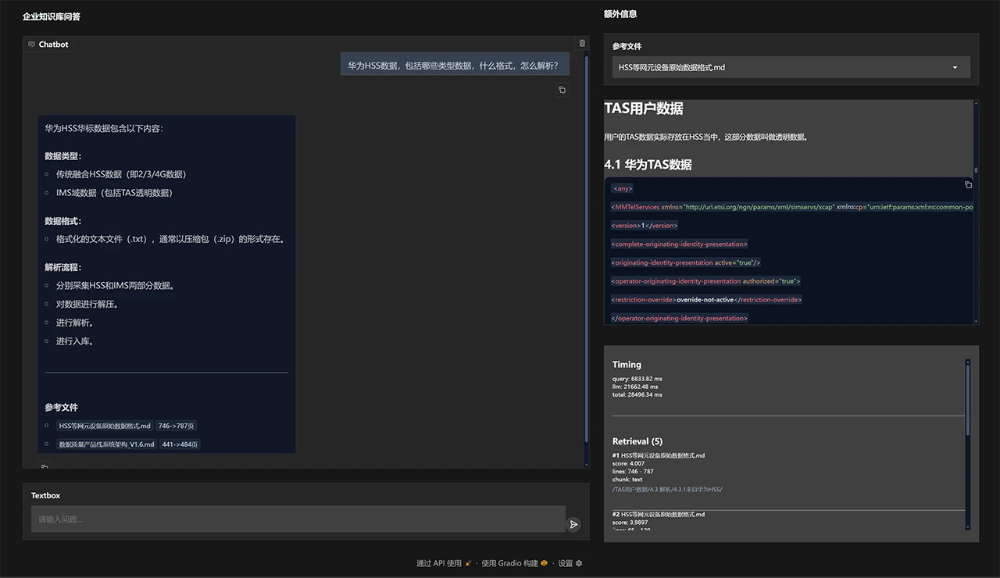

# Project Overview
[](https://blog.csdn.net/ddrfan?type=blog)
[](https://space.bilibili.com/688222797)

[简体中文](README.md) | **English**

## What Is This Project About?
I am experimenting with building applications based on LlamaIndex. Like this little cat, I am learning and exploring enterprise knowledge bases and RAG from scratch.  


## About LlamaIndex
> [!Note]
> LlamaIndex is a data ingestion and Retrieval-Augmented Generation (RAG) framework designed for large language models (LLMs). It connects external data sources such as local documents, databases, APIs, and knowledge bases to LLMs, enabling question answering based on private data.
>
> It was originally positioned as a "bridge between LLMs and external data" and later evolved into a complete RAG development framework. Developers can use LlamaIndex for document loading, chunking, embedding generation, index construction, retrieval, and reranking, then pass the retrieved results to an LLM for answer generation.
>
> LlamaIndex supports multiple data sources, vector databases, and model services, including PDF, Markdown, FAISS, Chroma, Qdrant, OpenAI, and local llama.cpp models. It also provides advanced RAG capabilities such as hybrid retrieval, query routing, and multi-index composition.
>
> Compared with traditional approaches that manually combine embeddings, vector databases, and prompts, LlamaIndex emphasizes modularity and composability, making it suitable for knowledge base QA, document search, code retrieval, and offline local RAG scenarios.


## Project Features
### (1) Building the Knowledge Base
1. Uses a custom parser (unfortunately...) to perform structure-based chunking on Markdown files according to their heading hierarchy.
1. Large chunks produced from structural chunking are further split into fixed-size chunks.
1. Small chunks produced from structural chunking are merged based on the size of subsequent chunks and whether they belong to the same heading.
1. Adds metadata to chunks and injects heading information into chunk text.
1. Enhances metadata according to heading, content, and predefined metadata rules (still under development and not fully enabled yet...).
1. Handles Chinese word segmentation and normalizes single carriage returns / CRLF line endings into standard line breaks.
1. Uses CUDA acceleration for embedding generation. 
   
### (2) Query and Retrieval
1. Uses hybrid retrieval combining LLM semantic search and BM25 keyword search.
1. Reranks retrieved results.
1. Provides a spinner and streaming output for impatient users.
1. Prevents empty responses when the LLM fails to generate an answer. 
1. Optional printing of retrieval hit details for debugging.
1. Supports both command-line and simple WebUI query interfaces.

## Installation
1. Clone the repository to a local directory: 
`git clone https://github.com/ShionWakanae/llamaIndexSample.git`
2. Create a virtual environment in the project directory: `python -m venv venv`
3. Activate the virtual environment: `.\venv\scripts\activate`
4. Install dependencies: `pip install -r requirements.txt`

## Usage
### (0) Convert Documents to Markdown Format
> [!Important]
> To stay focused on indexing and retrieval (including debugging), only Markdown documents are currently supported.
> Before proceeding, convert your documents into Markdown (`.md`) format first. You can use tools such as Microsoft's [markitdown](https://github.com/microsoft/markitdown), [pymupdf4llm](https://github.com/pymupdf/PyMuPDF4LLM), [docling](https://github.com/docling-project/docling), [marker](https://github.com/datalab-to/marker), and others.
>
> For usage examples of markitdown, refer to [`MarkItDownSample.py`](./src/ref/MarkItDownSample.py).
> This reference file cannot run directly within this project's environment. Please follow the instructions in the [markitdown](https://github.com/microsoft/markitdown) documentation to set up its runtime environment.
> 
> The main purpose of the sample script is to process images embedded in Word documents, such as diagrams, flowcharts, and architecture diagrams, converting them into corresponding text descriptions. Unfortunately, using a single prompt for many different image types does not work very well. A better approach would involve differentiated workflows or multiple agents specialized for different image categories. That is a separate topic with many challenges of its own. In any case, this is only a sample implementation.
> 
> Please manually review the converted `.md` files to ensure the formatting is correct, the document structure is complete, tables are properly aligned, image descriptions are accurate, and no table of contents (TOC) is included.
> The more manual effort invested early on, the more intelligent the system becomes later.
> 
> The sample command for converting all `.docx`, `.xlsx`, and `.pdf` files in a directory into `.md` files is:
``` shell
Python .\MarkItDownSample.py "Input dir" "Output dir"
```

### (1) Configure the LLM and Models

Copy `.env_sample` to `.env`, then modify the API endpoint, API key, and model configurations (local or online). Example configuration:
``` ini
LLM_API_BASE=https://api.openai.com/v1      # Local or online OpenAI-compatible API endpoint
LLM_API_KEY=sk-xxxxx                        # API key
LLM_MODEL=gpt-4.1-mini                      # Model name

EMBEDDING_MODEL=BAAI/bge-m3                # Optional; automatically downloaded from Hugging Face
RERANKER_MODEL=BAAI/bge-reranker-v2-m3     # Optional; automatically downloaded from Hugging Face
```

### (2) Build the Knowledge Base
Index `.md` files:
``` shell
python .\src\index_cli.py 'Your Markdown directory'
```

If you are using an NVIDIA GPU, CUDA is recommended. Otherwise, comment out the `device="cuda",` line.  
To install CUDA-enabled PyTorch (make sure to choose the correct CUDA version for your GPU):
``` shell
pip uninstall torch torchvision torchaudio
pip install torch torchvision torchaudio --index-url https://download.pytorch.org/whl/cu128
```

Performance comparison:
```yml
i9-12900F * Generating embeddings: 100%|█████████████████████| 582/582 [06:45<00:00, 1.43it/s] 
4060TI16G * Generating embeddings: 100%|█████████████████████| 582/582 [00:30<00:00, 19.26it/s]
```

### (3) Query the Knowledge Base
#### Command-Line Query
``` shell
python .\src\rag_cli.py 'Your question'
```

#### Browser-Based Query
1. Start the WebUI service.
``` shell
python .\src\reg_webui.py
```

1. Open your browser and visit `http://127.0.0.1:7860/` to query the knowledge base.  
Enter your question in the textbox at the lower left. The upper left area displays the chat history.  
CLick on a reference file from the conversation and previews the `.md` file content.  
The lower right section shows a small amount of debugging information, including timing and retrieval hits. Use the CLI for more detailed diagnostics.



## Video Demonstrations
Click to watch the videos on Bilibili:

[](https://www.bilibili.com/video/BV1rb9zB5EAD/) [](https://www.bilibili.com/video/BV1po9yBhEFH/)  


## Tech Stack
[](https://www.reddit.com/r/LlamaIndex/)


  


## Environment Support


## License


According to the LlamaIndex license statement, this project is released under the MIT License.